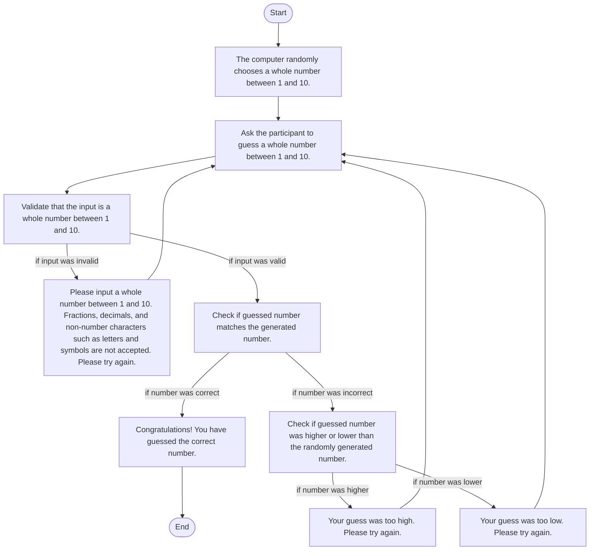

### Steps taken:
1. The computer selects a random whole number between 1 and 10.
2. The participant is asked to guess the number.
3. The computer validates that the input was a whole number between 1 and 10.
4. If the input was invalid, the participant is told to only guess whole numbers between 1 and 10, then sent back to step 2 to guess again.
5. If the input was valid, the computer checks to see if the guessed number was correct.
6. If the guessed number was correct, the participant is congratulated on their correct guess and the game ends.
7. If the guessed number was incorrect, the participant is told whether the guessed number was higher or lower than the randomly generated number, and then is sent back to step 2 to guess again.

